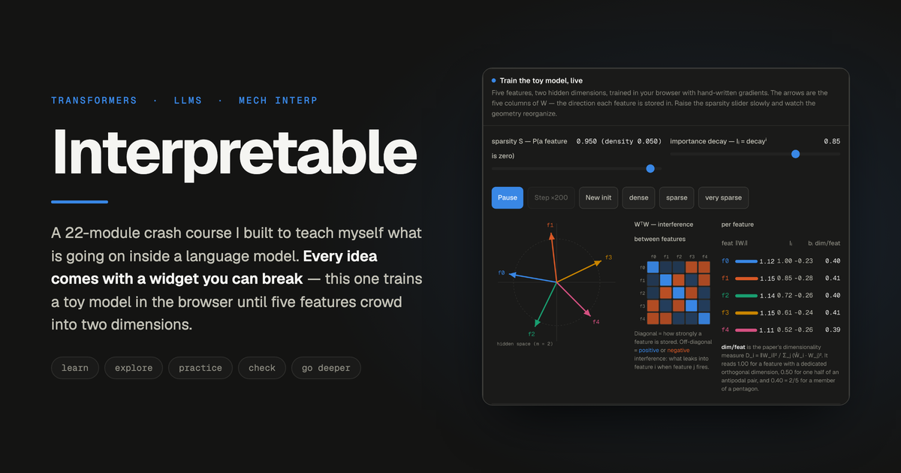
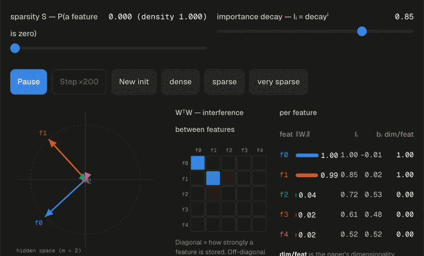
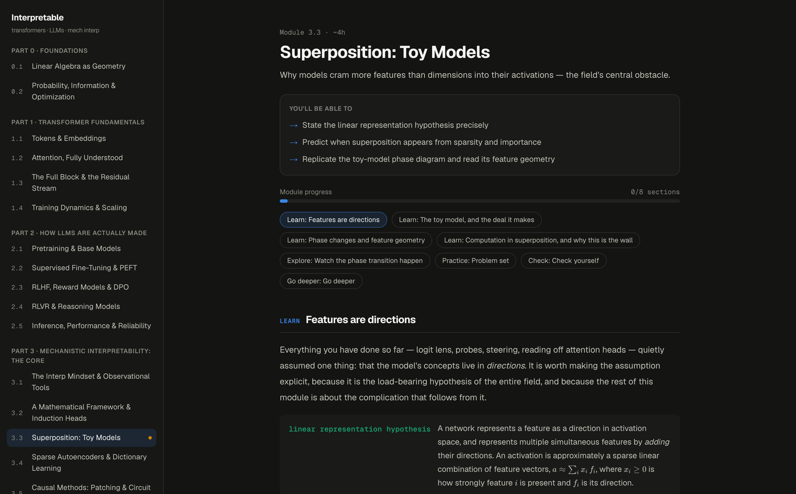

# Interpretable

_A crash course I built to teach myself what is going on inside a language model._

I am a visual learner who learns by doing, and the interpretability literature
is neither. So I built the course I wanted: 22 modules from linear algebra to
circuit tracing, where every idea comes with something you can pull on. Live at
**[mech-interp-rho.vercel.app](https://mech-interp-rho.vercel.app)**.



That is not a recording of a simulation. It is a five-feature, two-dimensional
autoencoder training in the browser on hand-written gradients while the sparsity
slider moves. At low sparsity the model stores two features on orthogonal axes
and throws the rest away. Raise sparsity and it changes its mind: three
directions, then four, then a pentagon — five features in two dimensions,
`dim/feat` settling at 0.40 = 2/5, exactly the geometry in the Toy Models paper.
The heat map beside it is WᵀW, so the off-diagonal cells are the interference
the model decided was worth living with.

## What is in it

22 modules across six parts, plus capstone projects — roughly 80 to 120 hours
end to end.

| Part | Modules |
|---|---|
| 0 · Foundations | linear algebra as geometry; probability, information, optimization |
| 1 · Transformer fundamentals | tokens & embeddings; attention; the full block & residual stream; training dynamics & scaling |
| 2 · How LLMs are actually made | pretraining; SFT & PEFT; RLHF & DPO; RLVR & reasoning; inference & reliability |
| 3 · Mechanistic interpretability: the core | the interp mindset; the mathematical framework & induction heads; superposition; sparse autoencoders; patching & circuit discovery |
| 4 · Frontier interpretability | circuit tracing; functional emotions; the global workspace |
| 5 · Safety, steering & editing | steering vectors; model editing & fast weights; the safety landscape |

The full scope, module by module, is in [CURRICULUM.md](./CURRICULUM.md).

## How a module works



Every module runs the same five-phase loop:

- **Learn** — diagrams before equations, and the equations annotated term by
  term. Every diagram is hand-built inline SVG; there is no chart library in the
  dependency list.
- **Explore** — 44 custom widgets across the course. Drag a query vector around
  a QK plane and watch the attention pattern follow, run BPE on your own text
  and see where the tokenizer does something stupid, sweep sparsity until
  superposition appears.
- **Practice** — problem sets with hints and full solutions: pencil-and-paper,
  code, and tool exploration.
- **Check** — quizzes that explain every option, not just the right one.
- **Go deeper** — the real literature with reading guides, so you know which
  sections matter before you open the PDF.

Sections are marked complete as you finish them; the dashboard, the sidebar and
the prev/next footer all carry you back to the section you were in.

## How it is put together

- **Next.js 16 App Router**, TypeScript, Tailwind v4, deployed on Vercel.
- Content is code. Each module is one `CourseModule` object in
  `src/modules/<slug>/index.tsx` with its widgets alongside it, validated
  against the schema in `src/lib/types.ts`. Conventions are written down in
  [docs/MODULE_AUTHORING.md](./docs/MODULE_AUTHORING.md).
- **Auth is optional.** Signed out, the whole course works and progress lives in
  `localStorage`. Signing in with Clerk syncs it: `/api/progress` merges the
  device's state into a single `progress` row in Neon Postgres keyed by Clerk
  user id, so a laptop and a phone converge instead of overwriting each other.
- **Offline.** A service worker precaches pages, assets and RSC payloads and
  re-warms about once an hour. There is a download-everything control and a
  per-lesson availability badge; `/api/*` is deliberately never intercepted.
- **KaTeX** for math, one dark design system in `src/app/globals.css`, and a
  fixed data-viz palette every widget draws from so the course reads as one
  thing.

## Running it locally

```bash
pnpm install
pnpm dev
```

That is enough to read the whole course — auth and the database are only needed
for cross-device sync.

### Environment variables

| Name | Needed for |
|---|---|
| `NEXT_PUBLIC_CLERK_PUBLISHABLE_KEY` | signing in |
| `CLERK_SECRET_KEY` | signing in |
| `DATABASE_URL` | the Neon-backed progress sync |

With the project linked to Vercel, `vercel env pull` writes all three. The
`progress` table is created on first use, so there is no migration step.
